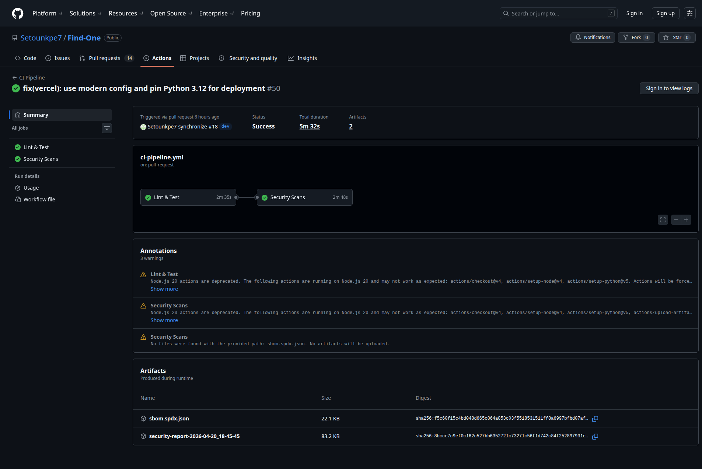
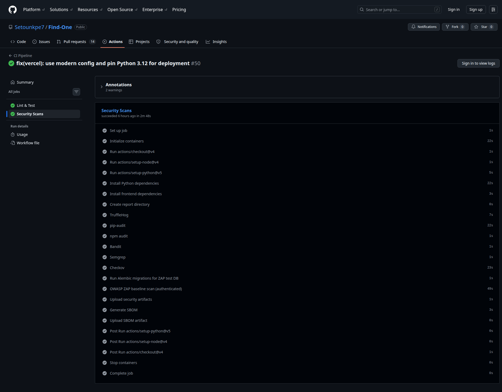
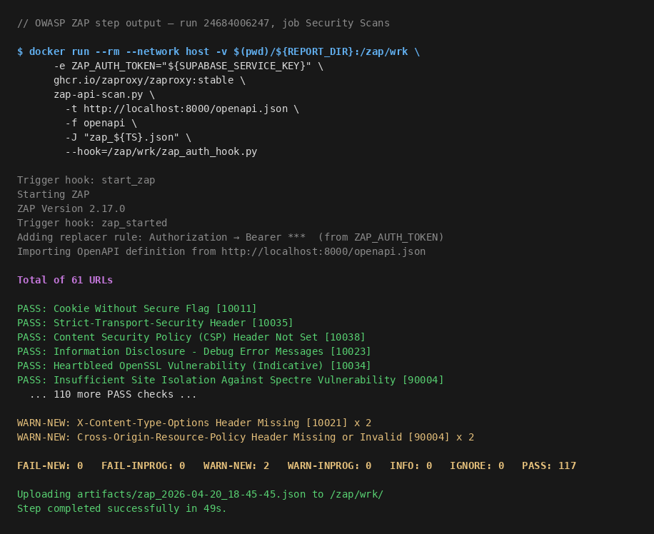
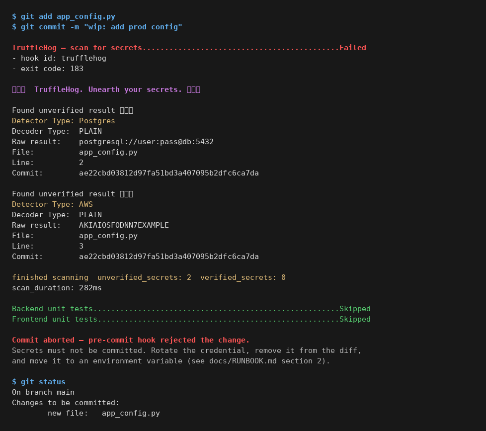
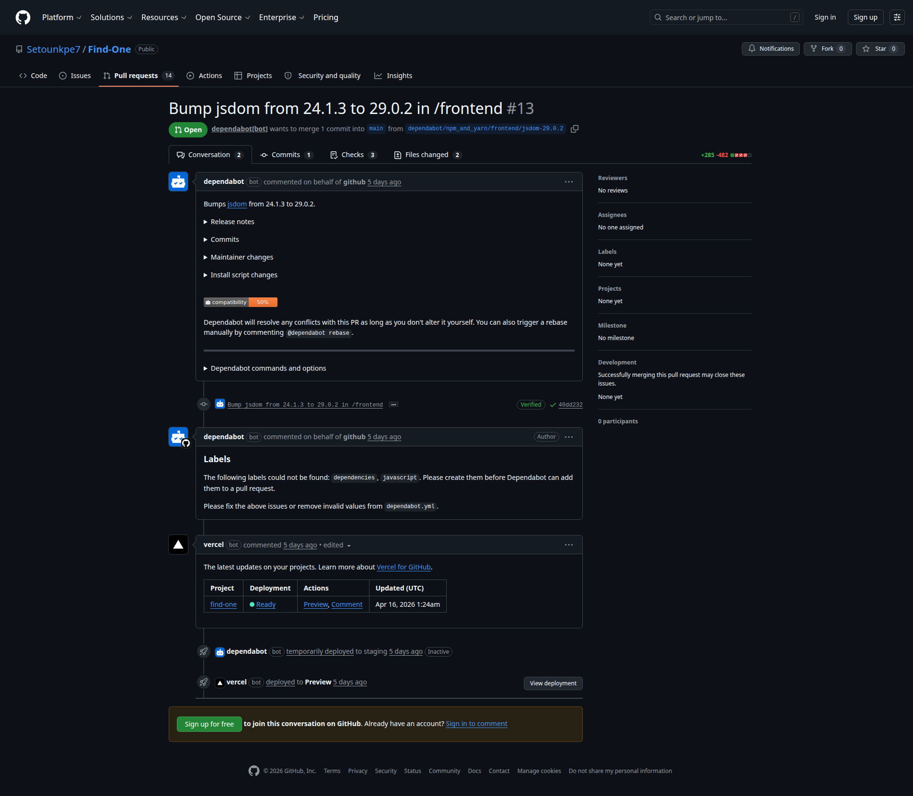
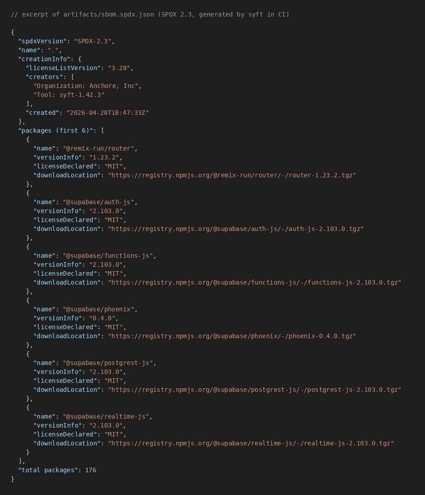

# DevSecOps case study: Find-One

## 1. Summary

Find-One is a small web app I started building during my own job search: a tracker for job postings with a feature that generates a tailored CV or cover letter for each one. This report isn't really about the app. It's about the safety net I wrapped around it: the automated checks that run every time I change code, the scanners that look for weaknesses, and the procedure for rolling back a broken deployment.


Here's what runs where. "Blocks PR" means the check can refuse to let a change merge into the main branch.

| Tool          | What it looks for            | Blocks PR?              | Where it runs        |
|---------------|------------------------------|-------------------------|----------------------|
| TruffleHog    | Leaked passwords / API keys  | Yes (verified only)     | pre-commit + CI      |
| pip-audit     | Vulnerable Python packages   | Yes (any vuln)          | CI                   |
| npm audit     | Vulnerable JS packages       | Yes (CRITICAL only)     | CI                   |
| Bandit        | Risky Python code patterns   | Yes (HIGH + MEDIUM conf)| CI                   |
| Semgrep       | Broader code-pattern checks  | No (report-only)        | CI                   |
| Checkov       | Misconfigured infra files    | No (report-only)        | CI                   |
| OWASP ZAP     | Live-app runtime attacks     | No (report-only)        | CI, authenticated    |
| syft          | Ingredient list of the app   | No                      | CI, every run        |
| Dependabot    | Outdated packages            | Opens PRs               | GitHub native        |

On the scan run captured in `artifacts/`, the pipeline finds 0 code-level bugs in 775 lines of backend code, 0 known vulnerabilities in 89 Python packages and 375 JavaScript packages, 2 config-file warnings (out of 209 checks), 4 "might be a secret?" hits that turned out to be the local development database URL (no real credential leaked), and 5 runtime warnings across 48 endpoints of the live app.


*Pipeline overview on a recent pull request. Lint & Test and Security Scans both green; artifacts available for download at the bottom.*

## 2. About Find-One

Find-One helps people track job applications. Users save a posting, mark its status (applied, interviewing, rejected), and generate a tailored CV or cover letter using Anthropic's Claude API. The backend is FastAPI on Python 3.12, the frontend is React 18 with Vite, sign-in and the database are handled by Supabase, and hosting is on Vercel. The source repo is `github.com/Setounkpe7/Find-One`.

## 3. What I'm protecting against (and what I'm not)

Software gets attacked in predictable ways. The pipeline covers six of them.

- **Bugs I wrote myself** that an attacker could abuse. Example: taking whatever the user typed and running it as a shell command without checking it first.
- **Known vulnerabilities in third-party packages.** The app uses 464 open-source libraries between backend and frontend. Each one is maintained by someone else, and every so often a security fix is published against one of them.
- **Secrets committed by accident.** Passwords, API keys, database URLs. The kind of thing that belongs in an environment variable but accidentally ends up in the code. Once a secret lands in git history, it's effectively public.
- **Misconfigured pipeline or deploy files.** My CI pipeline and my deploy config are themselves code. They can have their own security issues, like a GitHub Action pinned loosely or a Docker setting left open.
- **Runtime weaknesses in the live app.** The kind of thing you only see when the app is actually running and serving requests: missing security headers, cookies not marked secure, information leaking in error pages.
- **Supply-chain transparency.** A list of every open-source library I use, with versions, so anyone who depends on my app can check if it's affected by a newly-disclosed issue.

What I'm not covering, and I want to name it rather than pretend I have total coverage. No runtime protection once the app is actively under attack (no web application firewall in front of Vercel). No manual penetration test by a human. No insider-threat controls on the development side. No scanning of container images (Vercel builds the runtime, I don't ship a Docker image). Each of those is a deliberate choice, not a blind spot. I cover what I can realistically maintain alone. Adding things I can't keep current is worse than leaving them out.

## 4. The eight tools, and why each one

Most of these are open source or free. For each tool I'll explain what it does in plain language, then mention what I picked it over.

**TruffleHog catches leaked secrets.** If I accidentally paste an API key into a config file and try to commit it, TruffleHog blocks me. I run it twice: once on my laptop before the commit leaves, and again in the automated pipeline against the full repo history. The setting that matters is `--only-verified`. TruffleHog doesn't just flag strings that *look* like keys; it actually tests them against the real service (GitHub, AWS, Stripe, etc.) to check whether they're live. This cuts out the false alarms that train developers to disable the check entirely.

**Bandit reads Python code and flags dangerous patterns.** It knows things like "calling `pickle.loads` on untrusted input lets an attacker run arbitrary code" and "hardcoded passwords in source files are a bug". I set it to block only on HIGH severity plus MEDIUM confidence so it doesn't flag every test-file `assert`. A generic code linter doesn't know about these Python-specific pitfalls. Bandit does.

**Semgrep is similar, with a wider net.** It runs a larger set of rules across both Python and JavaScript code. The default ruleset is broad and sometimes opinionated (it flags stylistic preferences as if they were security issues), so I let it report findings without blocking merges. Bandit and Semgrep together are my belt and suspenders for *Static Application Security Testing (SAST)*.

**pip-audit checks my Python packages against the vulnerability database.** Every open-source package has a version history, and sometimes a version has a known security bug with the fix in a later version. pip-audit reads my `requirements.txt`, checks each dependency against the Python Packaging Advisory Database maintained by the PyPA, and reports anything that matches. 89 dependencies, 0 vulnerabilities on today's run. I block merges on any finding because the dependency tree is small enough that fixing is usually a one-line version bump. I picked pip-audit over Safety (a similar tool) because the PyPA database publishes CVE data faster than Safety's free tier.

**npm audit does the same job for JavaScript packages.** The frontend pulls in 375 packages, most of them transitively through Vite (the build tool) and Vitest (the test runner). Blocking on every finding would be a merge-freeze machine. I block on CRITICAL only, and let Dependabot (below) open automatic pull requests for the long tail of low and moderate findings. npm audit is built into npm itself, so no extra account is needed. Snyk would give richer data but requires a third-party subscription I don't need at this scale.

**OWASP ZAP attacks my live app from the outside.** This is a *dynamic scanner*: I spin up the backend in CI, ZAP makes real HTTP requests to it, and it looks for runtime issues like missing security headers, unsafe cookie flags, and information leaking in error responses. The industry term for this kind of testing is DAST. Section 6 covers the work I did to make this actually useful against an API backend (the default setup sees almost nothing).

**Checkov scans my configuration files.** My GitHub Actions workflows, my Docker Compose file, and my Vercel config are all configuration. Checkov reads them and flags problems. On the current run it reports 2 failures out of 209 checks, both about GitHub Actions being pinned to a version tag (`@v4`) instead of an exact commit hash, which is a supply-chain concern I'll address in a follow-up.

**syft generates the ingredient list.** In the software world this is called an SBOM (Software Bill of Materials). Think of it as the ingredient list on a food package, but for software: every open-source library my app uses, with version numbers. 176 packages on the current run, saved in SPDX 2.3 JSON. I picked SPDX over CycloneDX (another SBOM format) because SPDX is the format consumed by Sigstore and the SLSA framework if I later want to sign releases or prove where they came from.

**Dependabot keeps dependencies fresh.** Built into GitHub. Once a week it checks whether any of my packages has a newer version, and opens a pull request with the upgrade. The PR runs through the full pipeline, so I can see the scan results before I merge. I picked it over Renovate (a more configurable alternative) because Renovate's extra flexibility doesn't pay off at this scale.

## 5. How the pipeline is laid out

```
git commit ─▶ pre-commit ──▶ git push ──▶ PR opened on main
                │                          │
                ├─ TruffleHog              ├─ CI job 1: lint + tests (blocking)
                ├─ pytest                  ├─ CI job 2: security scans (mixed)
                └─ vitest                  └─ CI job 2: SBOM + artifact upload
                                                     │
                                                     ▼
                                             merge to main
                                                     │
                                                     ▼
                                           Vercel preview ─▶ promote to prod
```

Two ideas behind the layout.

First, defense in depth. Each layer catches what the previous one couldn't. Pre-commit catches mistakes still on my laptop, before anything leaves the machine. CI catches what slipped past pre-commit, plus things that only show up when you look at the full git history. Dependabot catches the drift neither of the others would find: a new vulnerability disclosed next Tuesday against a package I installed last March.

Second, fail-fast ordering. A broken build is a cheaper signal than a clean scan on code that wouldn't even compile, so the lint and unit-test job runs before any scanner. Inside the security job, the cheap-and-fast scanners go first. ZAP needs a running backend, so it goes last.


*Inside the Security Scans job. Each scanner is a separate step, results uploaded as artifacts at the end.*

## 6. Deep-dive 1: making OWASP ZAP actually useful on an API backend

This was the single most interesting decision in the pipeline, so it gets its own section.

The default way to use OWASP ZAP is to point it at a URL. ZAP acts like a search-engine crawler: it follows every link it finds on the home page, and scans each page it discovers. That works fine for a traditional website with clickable HTML navigation.

My backend is a REST API. There are no HTML pages to crawl. There are endpoints like `POST /api/jobs` and `GET /api/documents/{id}`, and they're invoked by the React frontend, not by a human clicking a link. When I first ran ZAP the default way, it visited three URLs total: the homepage, the `/health` endpoint, and a redirect. The 40-something real endpoints were invisible because nothing on the homepage linked to them.

Two changes fixed this.

**Change 1: hand ZAP the API spec instead of letting it crawl.** FastAPI (the backend framework) automatically publishes a machine-readable list of every endpoint at `/openapi.json`. I switched ZAP to read that file directly: `zap-api-scan.py -f openapi -t http://localhost:8000/openapi.json`. Now ZAP knows about every endpoint without having to guess. Coverage went from 3 URLs to 48.

**Change 2: log ZAP in first.** Most of my endpoints require a signed-in user. If ZAP hits them without a login, the backend returns "401 Unauthorized" and the scanner never sees the real logic behind the endpoint. I wrote a short Python hook (`zap_auth_hook.py`, about 30 lines) that attaches an authentication token to every request ZAP sends. The token is a Supabase "service-role" token signed with a shared secret; the backend recognizes it as "this is the CI test run" and lets it through.

Using a service-role token in CI might sound risky, so I want to address it head-on. It's acceptable here because the scan runs against a throwaway database that's created fresh at the start of every CI run. There is no real user data to reach. I would not do this against a shared staging environment.

End result: ZAP now actually exercises the authenticated paths of the app (create a job, upload a document, fetch a profile), not just the three public pages on the outside.


*The ZAP step in the live pipeline, reading /openapi.json and scanning every declared endpoint with the Bearer token injected by the hook.*

## 7. Deep-dive 2: blocking rules are different for each tool

A common rookie move is "block on any finding, from any scanner." That sounds rigorous. In practice it means people learn to disable the checks, because no scanner produces zero false positives on a real codebase. So I set a different threshold per tool, based on the kind of signal each one produces.

**pip-audit: block on any finding.** 89 Python packages, fresh CVE data, and most vulnerabilities are directly exploitable at runtime. Fix cost is almost always a one-line version bump. Worth blocking for.

**npm audit: block on CRITICAL only.** 375 JavaScript packages, most of them only used during local development (Vite dev server, test runners) and never shipped to end users. Blocking on every low-severity finding would mean constantly-stuck PRs without a proportional reduction in risk.

**Bandit: HIGH severity, MEDIUM confidence.** Without a confidence floor, Bandit flags every `assert` in every test file (B101). With the floor, the blocking set aligns with issues that would survive a code review.

**Semgrep: report-only.** The `auto` ruleset is broad and partly subjective. I read the findings but don't use them as a merge gate.

**TruffleHog: verified secrets only.** An unverified pattern-match is often a false positive (a random 40-character string that happens to look like an AWS key, or a development placeholder). A verified hit is a live credential someone could use right now. That absolutely warrants blocking a merge.

**Checkov: report-only.** Config-file findings at my scale are useful input, not urgent. I review them weekly.

## 8. Deep-dive 3: two layers of secrets scanning

Two checks, same tool (TruffleHog), same flag (`--only-verified`), because they catch different failure modes.

**Layer 1: pre-commit, on my laptop.** Runs against the diff I'm about to push. If I paste an API key into a config file during a long debugging session and forget to remove it, TruffleHog blocks the commit before anything leaves the machine. This layer catches most mistakes because most leaked-secret incidents happen exactly like this.


*A local demo: pre-commit catches a fake AWS key and a Postgres URL in a staged file, blocks the commit, points the developer to the runbook.*

**Layer 2: in CI, against the full history.** When a pull request is opened, the CI checkout pulls the entire git history (`fetch-depth: 0`) and TruffleHog scans all of it. This layer catches the case pre-commit can't: a secret that was committed months ago on a feature branch, reverted in the next commit, but still sitting in the git history where anyone with a clone can find it. It also catches the case where someone force-pushes around pre-commit entirely.

Running the same tool twice is cheaper than introducing a second tool. Different scope, same reliability.

## 9. Deep-dive 4: what the pipeline actually caught, and how it got fixed

A pipeline with zero findings on every scan isn't a successful pipeline. It's a pipeline that probably isn't scanning anything. What proves this setup is doing real work is the gap between the first run and today's run.

Here's the comparison, same app, same tools, different commits.

| Scanner      | First run          | Last run  |
|--------------|---------------------------------------|---------------------------|
| Bandit       | 1 MEDIUM finding | 0 findings   |
| pip-audit    | 2 vulnerable packages      | 0 vulnerable    |
| npm audit    | 4 moderate vulnerabilities            | 0 vulnerabilities         |

The Bandit finding was **B108 (hardcoded temp directory)** in `backend/app/services/storage.py` line 10. Bandit doesn't like code that writes to a fixed path like `/tmp/...` because anyone with shell access on the same machine can predict the path and slip a file in. The fix was a two-line change: import Python's `tempfile` module and swap the hardcoded `/tmp` for `tempfile.gettempdir()`.

The two pip-audit findings were more interesting because they're dependencies I don't control:

- **`starlette 0.37.2`** was flagged for CVE-2024-47874 (a denial-of-service via multipart form parsing) and CVE-2025-54121 (a path-traversal condition). Updating to `0.49.3` closed both.
- **`requests 2.32.5`** was flagged for CVE-2026-25645. Updating to `2.33.1` closed it.

Both upgrades came in as automated Dependabot pull requests. Each PR ran through the full pipeline before I merged, so I could see that the upgrade didn't break anything.


*Dependabot opens a PR per upgrade, with the release notes, the diff, and the full CI pipeline attached. Merging is a click once I've reviewed.*

The four npm findings were moderate-severity issues in transitive dependencies (packages pulled in by my direct dependencies). They got resolved in a batch by the same Dependabot mechanism, pulling in minor-version upgrades across Vite and Vitest.

What the numbers show: the pipeline surfaced real, fixable issues on day one. The Bandit finding was a code smell I'd have shipped without thinking about it. The pip-audit findings were two real CVEs on code I didn't write and hadn't audited. Finding them required the scanners. Fixing them took about twenty minutes of total work across three PRs. That's the posture paying off: cheap to find, cheap to fix, before anything reached production.

The codebase has grown since (from 694 to 775 lines of Python, with the Python dependencies tree trimmed from 195 to 89 after a cleanup pass, and the JS tree holding steady around 375 packages), and the scanners all currently report clean. That will change. A new CVE will land against one of my dependencie next month, or I'll write code that trips Bandit. When it does, the pipeline is already wired to catch it on the PR that introduces it, not in production.

## 10. Operational side: artifacts, rollbacks, Dependabot

Every CI run uploads two bundles that stay available for 30 days: the full set of scan outputs, and the SBOM. If a problem shows up three weeks after the fact, I can pull the exact scan results from the commit where it first appeared. That matters for audit and for the "when did this start?" investigation.


*Artifacts panel from a recent run: the security-report bundle (all scanner outputs) and the SBOM, both downloadable for 30 days.*


*The SBOM (Software Bill of Materials) in SPDX 2.3 JSON, generated by syft on every run. One package entry per open-source library in the app.*

Rollback is documented in `artifacts/runbook.md`. If a production deploy breaks, I open the Vercel dashboard, click "promote to production" on the last good deployment, and verify with `curl /api/health`. End-to-end under 30 seconds. The same runbook has a procedure for each blocking scanner (pip-audit, npm audit, Bandit, TruffleHog), so a blocked PR becomes a recipe to follow, not a problem to solve from scratch.


## 11. What I haven't done yet

Every security setup has gaps. Here are mine, with the reasons.

**No container image scanning.** Vercel builds my deploy artifact as a serverless bundle. I don't ship a Docker image. If I move to a self-hosted deployment that involves an image, this becomes the first thing I add.

**No signed commits, no SLSA provenance.** These are the next layer beyond an SBOM. They prove not just what's in the release, but that it came from this repo, built by this pipeline. The SBOM is already in a compatible format, so the follow-up work isn't huge. Parked for a future iteration.

**Semgrep as a blocking gate.** Needs a curated ruleset so it stops flagging stylistic preferences.

**Checkov findings on version pinning.** The two failing checks are about my GitHub Actions using `@v4` instead of an exact commit hash. The fix is one line per action, but without Renovate auto-updating the hashes I'd be stuck doing it manually on every new release. For now, `@v4` is a conscious tradeoff.

Each of these is a known issue, not a blind spot I missed. That distinction is what I'd want a reviewer to see if they were auditing my pipeline.

## 12. Appendix: what's in this repo

- `artifacts/ci-pipeline.yml`: the GitHub Actions workflow.
- `artifacts/pre-commit-config.yaml`: the pre-commit hook definitions.
- `artifacts/dependabot.yml`: the Dependabot config.
- `artifacts/zap_auth_hook.py`: the ZAP authentication hook.
- `artifacts/sbom.spdx.json`: the SBOM, SPDX 2.3, 176 packages.
- `artifacts/runbook.md`: rollback and scan-failure procedures.
- `artifacts/scans/`: seven JSON outputs from the scanners described above.
- `screenshots/`: seven captures of the pipeline in action on `Setounkpe7/Find-One`.

## 13. Related work

- [railsgoat-security](https://github.com/Setounkpe7/railsgoat-security) —
  the same DevSecOps approach applied to a deliberately vulnerable Rails
  training app (OWASP RailsGoat). Adds container scanning, DAST against a
  live container, and a Cosign-signed image on GHCR — the layers
  Find-One didn't need because of its serverless deployment model.
